## 기능 명세서

[기능명세서.xlsx](기능명세서.xlsx)

## 데이터 도메인

[데이터 도메인.xlsx](데이터도메인.xlsx)

## 메뉴 구조도

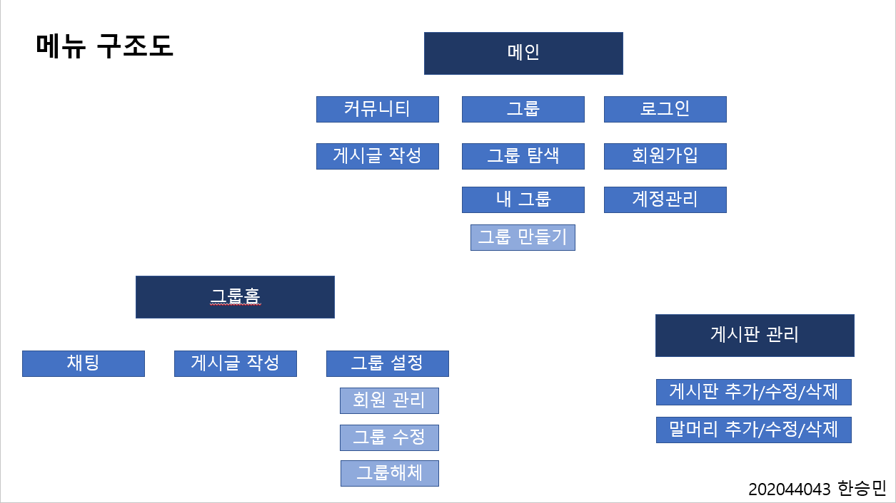</img>
## 화면 설계도

게시글 작성
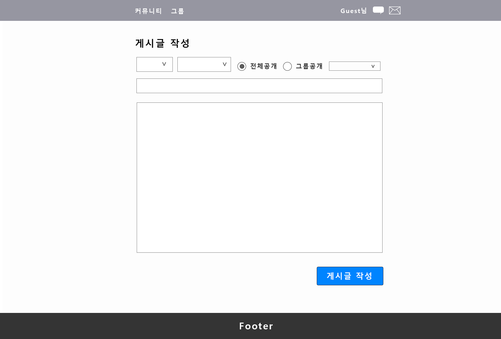

게시판 관리
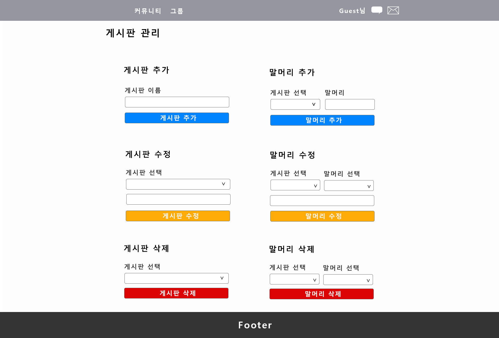

그룹 만들기
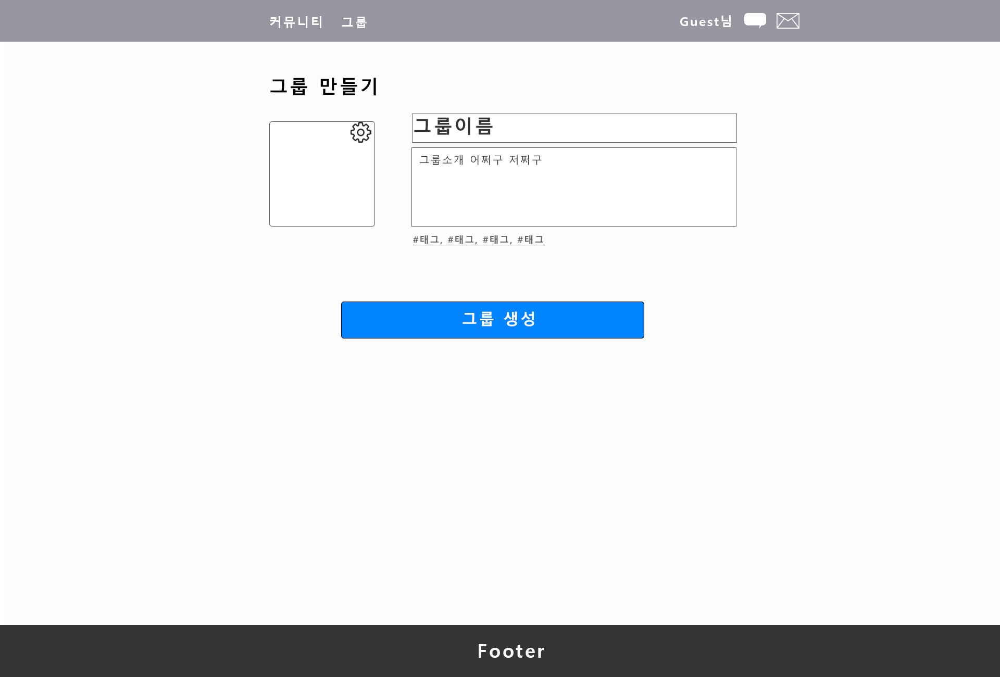

그룹설정
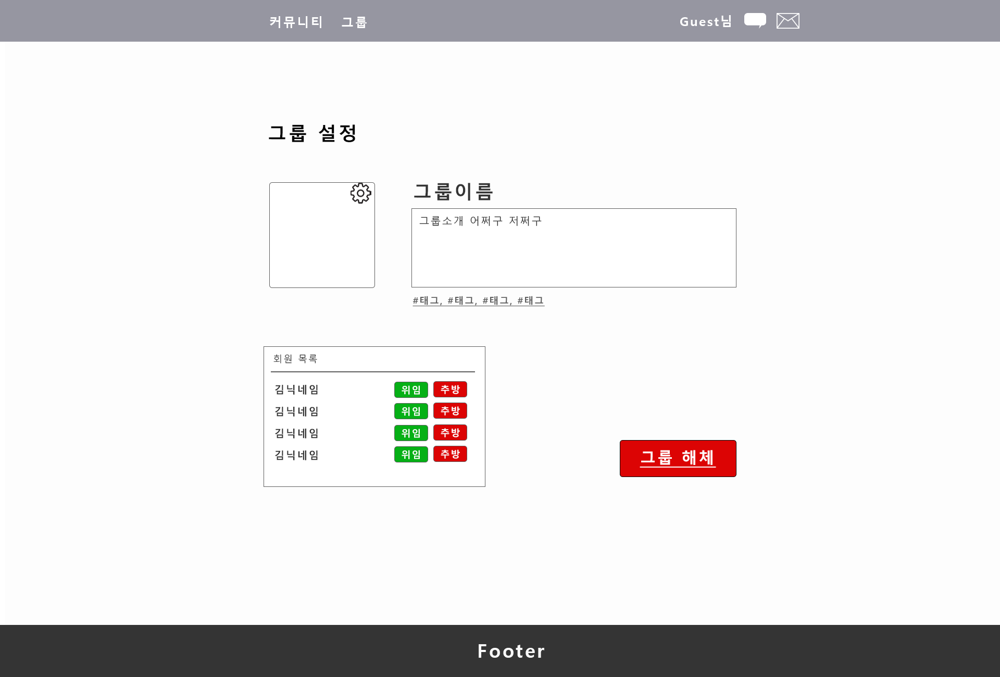

그룹탐색
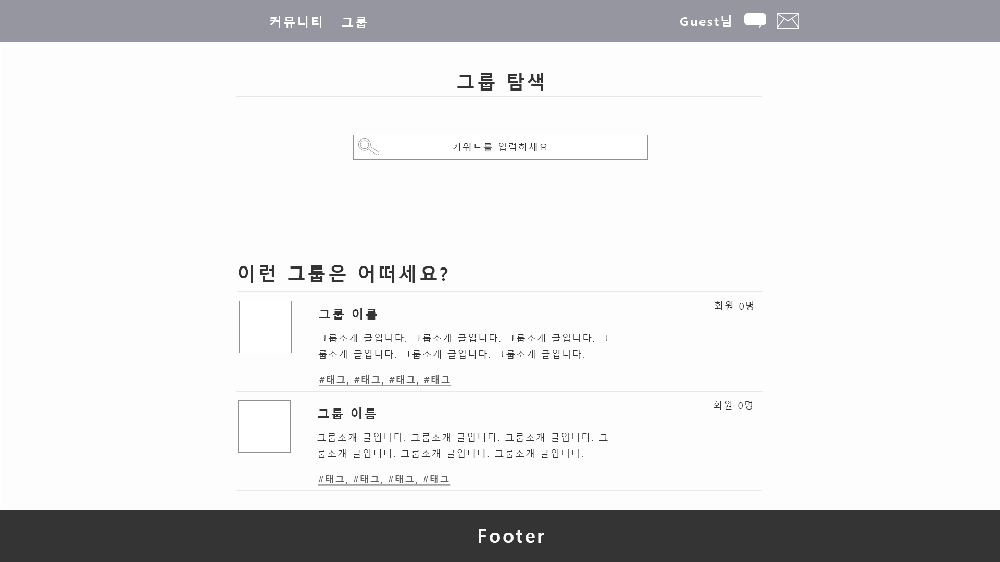

그룹홈
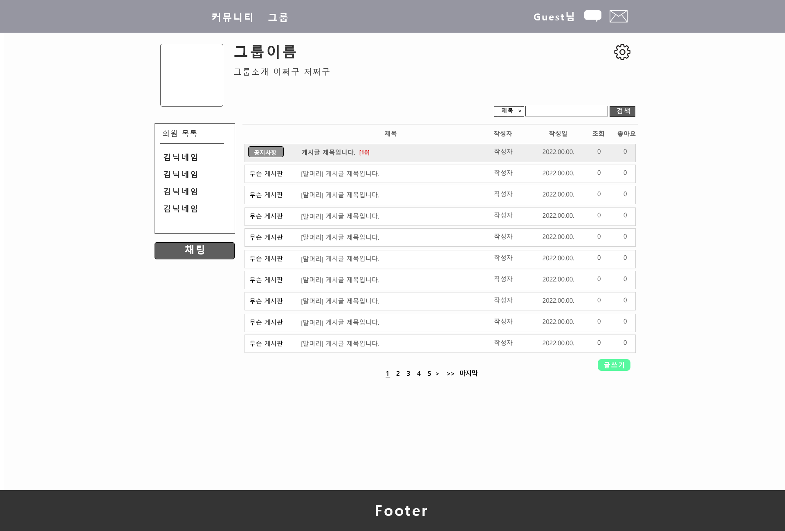

내 계정관리
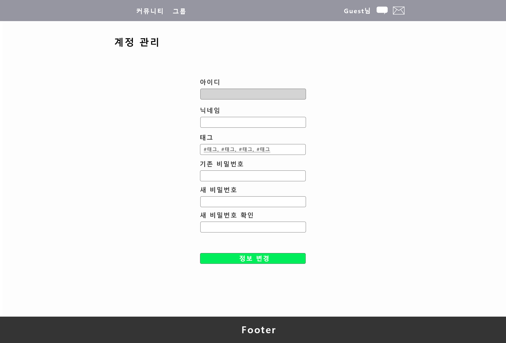

내 그룹
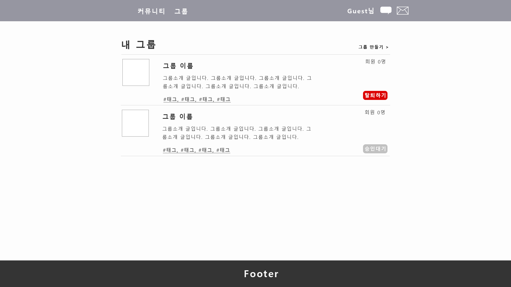

로그인

메인
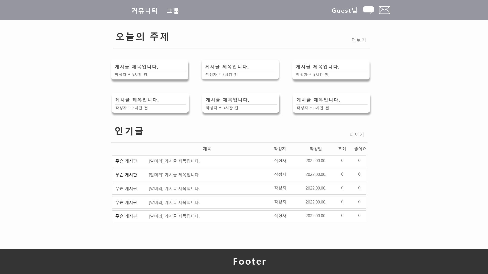

채팅
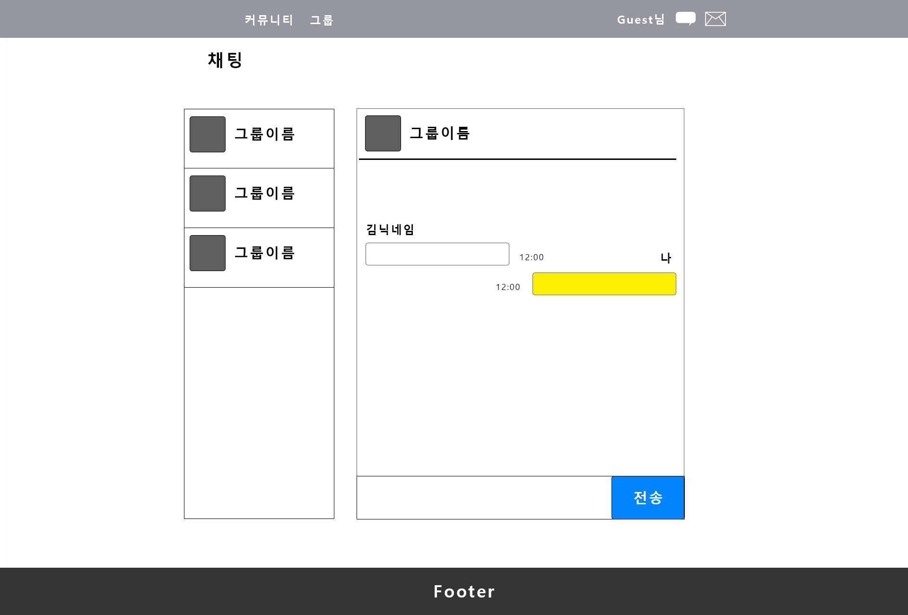

커뮤니티
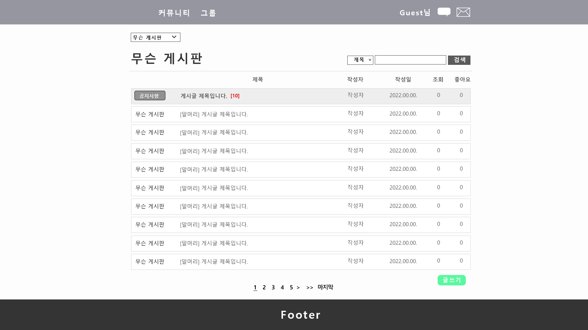

회원가입
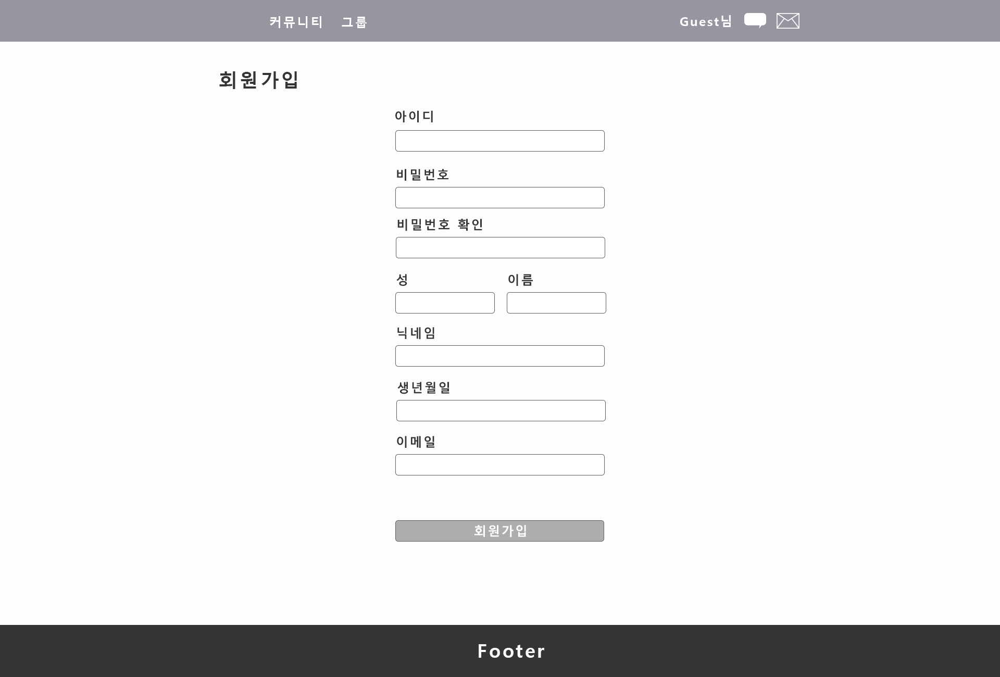

## 스키마 생성 SQL

[table_define.sql](table_define.sql)
