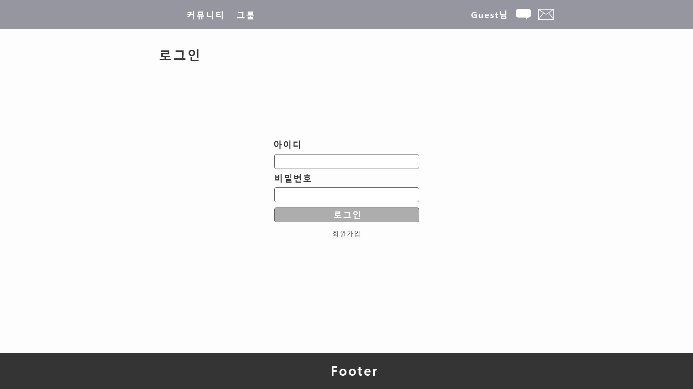

## 기능 명세서

[기능명세서.xlsx](기능명세서.xlsx)

## 데이터 도메인

[데이터 도메인.xlsx](데이터도메인.xlsx)

## 메뉴 구조도

</img>
## 화면 설계도

게시글 작성

게시판 관리

그룹 만들기

그룹설정

그룹탐색

그룹홈

내 계정관리

내 그룹

로그인

메인

채팅

커뮤니티

회원가입

## 스키마 생성 SQL

[table_define.sql](table_define.sql)
